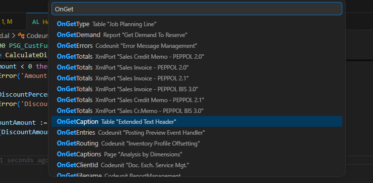
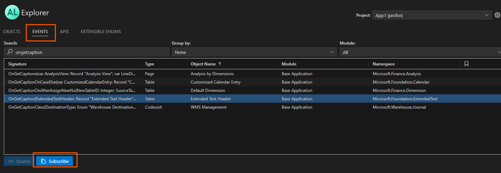

Coding Guidelines
=================

## Sprache

Alle Objekt-Namen, Variablen, Labels (und deren Wert), Namen von Prozeduren, Kommentare, Felder, etc. werden auf `englisch` benannt/geschrieben. 

## Namespaces:

**Eigene Apps**: Verwende den Namespace:  `PSG.App.[Name der App]`. Der *Name der App* wird zusammen geschrieben (z.B. PSG.App.MeineNeueApp).

**Kundenprojekte**: Verwende `PSG.Customization.[Name des Kunden]`. Der *Name des Kunden* wird zusammengeschriebenen (z.B. PSG.Customization.MustermannAG).

## Benamung von Objekten (Tabellen, Pages & Co.)

Alle Objekte erhalten den Präfix `PSG_`. Gefolgt von den eigentlichen Namen **ohne** Sonderzeichen.<br>
Beispiele: 
- PSG_MeineNeueTabelle
- PSG_MeinNeuesFeld
- PSG_MeinePageGroup
- PSG_MeinEnumValue
- PSG_MeinePage

> Ausgeschlossen von dieser Regel sind `Prozeduren (inkl. Event-Subscriber)` & `Seiten-Felder`.

## Benamung von Dateinamen

Die Dateinamen müssen nach folgenden Schema benamt werden: `PSG[Objekt-Name].[Objekt-Typ].al`. Bei **Extensions** wird der Objekt-Name mit **Ext** abgekürzt. Der Unterstrich "**_**" vom Objekt-Namen entfällt dabei.  <br>
Beispiele:
- PSGMeineCodeunit.Codeunit.al
- PSGMeineTableExt.TableExt.al
- PSGMeinePage.Page.al
- PSGMeinEnum.Enum.al

## Nummerierung von Tabellenfelder

Bei **neu erstellten Tabellen**, beginnt die Nummerierung der Tabellenfelder bei `1`.

Bei Felder in einer **Table-Extension**, beginnt die Nummerierung bei **Start-ID** aus der `app.json`.

## Reservierter ID-Bereich

> Der ID-Bereich von 50900 bis 50999 ist für Kunden reserviert, die eigene Entwicklungen vornehmen möchten. In diesem Bereich werden individuelle Anpassungen ermöglicht.


## Seiten-Felder

Der Feld-Name auf einer Seite, darf wieder mit Anführungzeichen geschrieben werden. <br>
Beispiel:

```
field("Order Quantity"; Rec.PSG_OrderQuantity) { }
```

## Vereinfachung bei der Verwendung von Properties

Bestimmte Propteries wie `DataClassification` können sowohl auf Objektebene (z.B. `Tabelle`), als auch direkt beim Feld definiert werden.

In diesen Fall gilt folgende Regel:

> Kann eine Property auf Objekt-Ebene, wie einer Tabelle, definiert ist dies zu bevorzugen. 
> Die Property darf auf Feld-Ebene definiert werden, wenn ein anderer Wert verwendet wird. <br>
> Bei Extensions können die Properties nicht auf Objekt-Ebene definiert werden und müssen auf Feld-Ebene gesetzt werden. (Stand BC 28.0)

Folgende Properties können auf Objekt-Ebene definiert werden:
- ApplicationArea (Page)
- DataClassification (Table)

## Prozeduren

### Benamung von Prozeduren

Der Name der Prozedur sollte immer eine sehr kurze Zusammenfassung wiedergeben, was diese macht.

Auch ist der Coding-Standard einzuhalten. Prozeduren mit bestimmten Präfixen, sollten das wiedergeben was man im Standard erwartet.

| Präfix     | Rückgabe                                                                        |
| ---------- | ------------------------------------------------------------------------------- |
| Validate.. | Liefert `true` (oder `Error`) zurück, wenn die geprüften Daten in Ordnung sind. |
| Has...     | Liefert `true` zurück, wenn etwas vorhanden ist.                                |


### Sichtbarkeit von Prozeduren

Über die Zugrifffsmodifizierer kann gesteuert werden, wie weit eine Prozedur sichtbar sein soll.

> Es müssen sich Gedanken gemacht wie weit man eine Prozedur "sehen" darf. <br>
> Dabei gilt das Prinzip: **So private wie möglich, so öffentlich wie nötig.**

Es gibt folgende Zugriffs-Optionen:

| Modifier             | Zugriff                                                                                                                                     |
| -------------------- | ------------------------------------------------------------------------------------------------------------------------------------------- |
| `local procedure`    | Diese Prodezur ist nur innerhalb des aktuellen Objektes (z.B. Codeunit) verfügbar und kann von einer anderen Objekt nicht verwendet werden. |
| `internal procedure` | Die Prozedur ist innerhalb der gesamten App verfügbar. Kann nicht von anderen Apps verwendet werden.                                        |
| `procedure`          | Die Prozedur kann auch von anderen Apps verwendet, wenn diese eine Abhängigkeit auf unsere App haben.                                       |

### Code-Länge einer Prozedur

Eine Produr sollte nicht dutzend Zeilen an Code besitzen. Ist eine Prozedur zu lang ist diese in kleinere Prozeduren zu unterteilen.

## Event-Subscriber

> Event-Subscriber sind immer **lokale** Prozeduren!<br>
> Die Logik von Subscriber ist immer in andere Codeunits auszulagern

### Benamung von Event-Subscriber

Die Benamung eines Event-Subscriber geschieht nach folgenden Schema: `"[Name des Objektes]_[Event-Name]"`. <br>
Beispiel: Man aboniert das Event "OnGetCaption" (*Event-Name*) aus der Tabelle "Extended Text Header" (*Name des Objektes*). Dann lautet der Name der Prozedur `"Extended Text Header_OnGetCaption"`.

``` al
[EventSubscriber(ObjectType::Table, Database::"Extended Text Header", OnGetCaption, '', false, false)]
local procedure "Extended Text Header_OnGetCaption"(ExtendedTextHeader: Record "Extended Text Header"; var Descr: Text)
begin
end;

```

> **Tipp 1:** Man kann die den Shortcut **ALT + SHIFT + E** verwenden, um den Event-Explorer zu öffnen und nach dem Event suchen. Nach der Auswahl des Event, wird die Prozedur nach diesem Schema angelegt.



> **Tipp 2**: Oder man ruft den **AL-Explorer** auf und sucht nach dem Event. Anschließend kann mansich mit `Subscribe` den Event-Subscriber in die Zwischenablage kopieren und in der passenden Codeunit einfügen.



### Separation der Subscriber

> Alle Subscriber müssen in einer eigenen Codeunit sein und dürfen nicht mit anderen Prozeduren vermischt werden.<br>
> Posting- & Sonstige Subscriber sind zu separieren.<br>
> Hat eine Codeunit zu viele Subscriber (> 15), sind diese Subscriber in weitere Codeunits zu splitten (z.B. `TableSubscriber` und `CodeunitSubscriber`). Gibt es zu einem Objekt (z.B. Codeunit) viele Subscriber, ist dafür ebenfalls eine eigene Codeunit anzulegen (z.B. `SalesPostSubscriber`).

## Benamung von Variablen

> Benenne Variablen so, dass sie dem entsprechen wofür Sie da sind.

**FALSCH**:

```
var 
  X : Record Customer;
  Hello : Codunit "Sales-Post";
```

**RICHTIG**:

```
var 
  Customer : Record Customer;
  SalesPost : Codunit "Sales-Post";
```

## Versionierung der App

Eine Versionsnummer besteht aus den folgenden Bestandteilen:

&lt;`Major`&gt;.&lt;`Minor`&gt;.&lt;`Build`&gt;.&lt;`Revision`&gt;

| Versionsteil | Beschreibung                                                                                  |
| ------------ | --------------------------------------------------------------------------------------------- |
| Major        | Version von BC                                                                                |
| Minor        | Interne Versionierung (wird erhöht, wenn die App ins PROD-System/App-Source gepublished wird) |
| Build        | Automatische Nummer beim Builden der App aus GitHub                                           |
| Revision     | Hofixes und kleiner Änderungen                                                                |

**Entwicklung**: Verwende das Format "BC-Version.0.0.1". <br>
**Produktivstart**: Ändere auf "BCVersion.1.0.0".